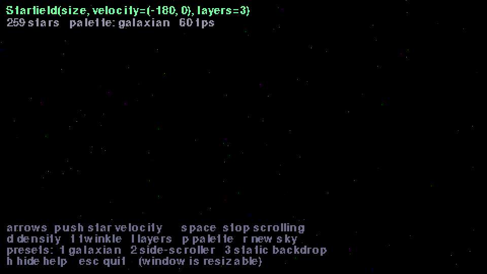
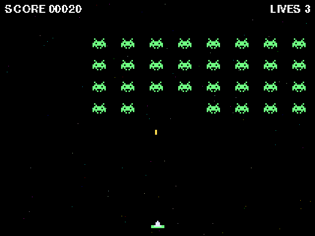
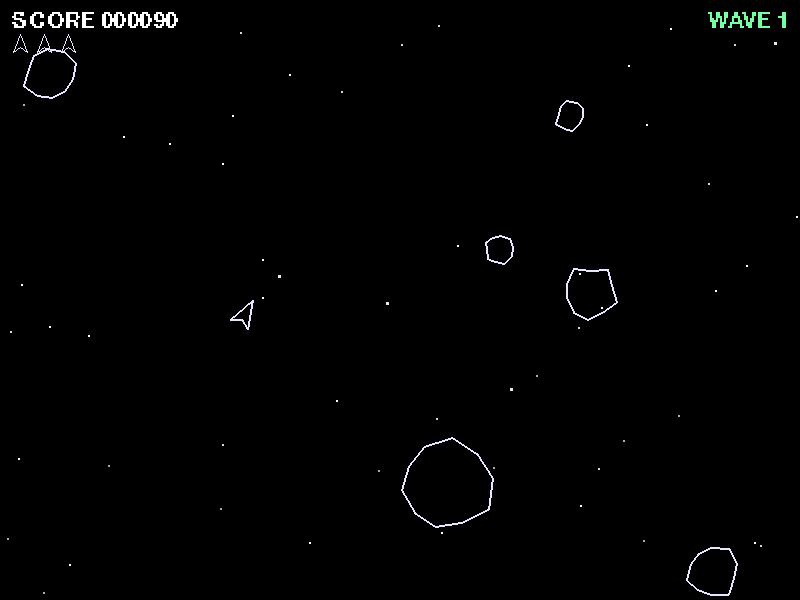
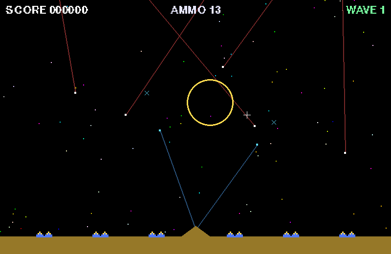
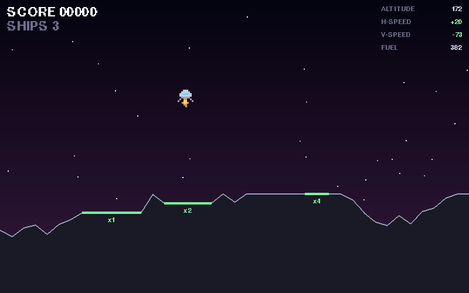
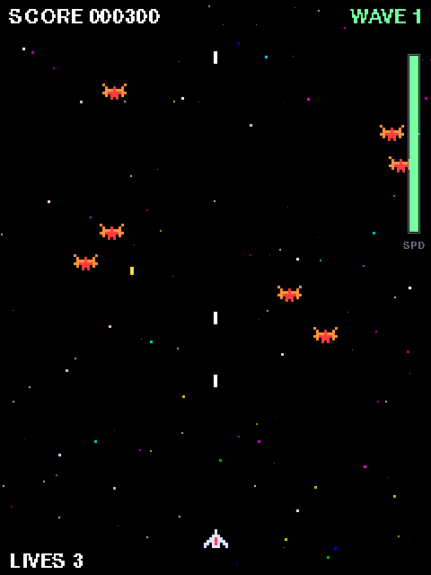
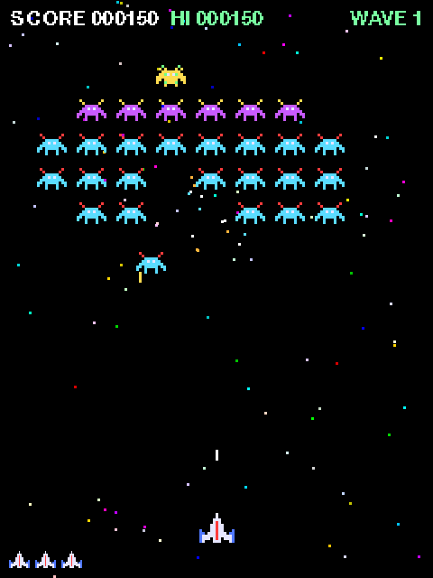
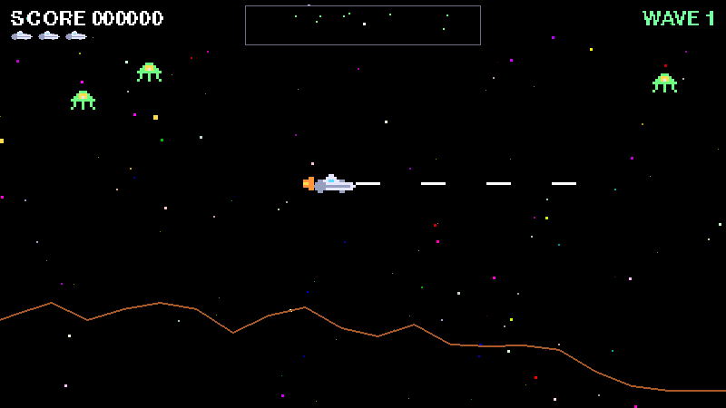
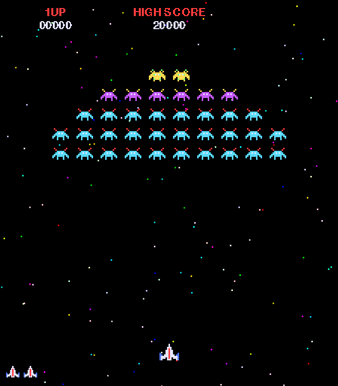

# galaxian-starfield-starter-kit

An arcade-style **starfield background for [pygame-ce](https://pyga.me/)**
that you can drop into any game — any window size, any scroll direction
and speed (or none at all), twinkle, parallax depth, adjustable density
and star size, the real Galaxian star colors — **plus seven playable demo
games and a from-scratch beginner tutorial** showing how to use it.

Built for novice game developers: every sprite is ASCII art in the source,
every sound is synthesized in ~30 lines you can read, and every game is
small enough to understand in one sitting.

## Quick start

With [uv](https://docs.astral.sh/uv/) (it fetches Python and dependencies
for you):

```sh
git clone https://github.com/pmirvine/galaxian-starfield-starter-kit.git
cd galaxian-starfield-starter-kit
uv run starfield-demo     # start here: the interactive playground
```

Or with plain pip (Python 3.10+): `pip install -e .` then `starfield-demo`.

## The demos

Nine programs ship with the kit. Each is complete, readable in one
sitting, and chosen to teach a **different starfield setup** and a
**different game-programming lesson** — together they cover every
parameter the library has.

| | |
| --- | --- |
|  | **`uv run starfield-demo`** — the interactive playground. Every parameter is on a key (velocity, density, twinkle, layers, palette, star size), and the HUD shows the exact `Starfield(...)` constructor line for what you're looking at, ready to copy into your own game. |
|  | **`uv run invaders`** — the tutorial game. A marching grid over a **static, twinkling backdrop** (`velocity=(0, 0)`). The simplest code in the kit — one file, lists of rects, no classes — and [docs/tutorial.md](docs/tutorial.md) builds it from an empty file, step by step. |
|  | **`uv run asteroids`** — rotation and thrust as *vectors*, wrap-around space, circle collisions, rocks that split. The starfield is the **quiet configuration**: still, sparse, plain white (`count=90, palette="white"`), so it reads like a 1979 vector monitor. |
|  | **`uv run missiles`** — the **mouse** demo: click the sky and an interceptor blooms into an expanding blast; enemy warheads die into blasts of their own, so shots chain. Missile trails are just two points and a line. Still night sky in the arcade palette. |
|  | **`uv run lander`** — gravity, fuel, and an instrument panel that turns red when your touchdown numbers would kill you. Shows **stars over your own art**: the field uses `background=None` and is drawn on top of a dusk-gradient sky the game paints itself. |
|  | **`uv run skyraid`** — a vertical shooter where **your throttle drives the sky**: the game rewrites `stars.velocity` every frame, raiders dive faster when you fly faster, and clearing a wave triggers a **warp burst** to ~1500 px/s. The live-velocity showcase. |
|  | **`uv run galaxians`** — the big structured sample: title and game-over scenes, a swaying convoy, curved diving attacks, waves and extra lives, under the classic **drifting Galaxian sky**. Its `settings.py` / `sprites.py` / `entities.py` / `main.py` layout is the shape to copy for a real project. |
|  | **`uv run defender`** — momentum flight through a **wrapping world**, with a look-ahead camera that drives the starfield via `scroll()` and **three parallax layers** for depth, plus a radar. The technique for any side-scroller. |
|  | **`uv run galaxians-demo`** — non-interactive: the starfield at Galaxian's **true 1979 geometry** (224×256 at 3×, 252 three-pixel stars, drifting at the hardware's exact ~91 px/s) behind a frozen convoy and score header. The heritage exhibit — and a clean skeleton to grow into your own game. |

## The starfield in three lines

```python
import pygame
from starfield_kit import Starfield

pygame.init()
screen = pygame.display.set_mode((800, 600))
clock = pygame.time.Clock()

field = Starfield(screen.get_size())            # 1 — create

running = True
while running:
    dt = clock.tick(60) / 1000
    for event in pygame.event.get():
        if event.type == pygame.QUIT:
            running = False

    field.update(dt)                            # 2 — animate
    field.draw(screen)                          # 3 — draw first
    # ... your ships, aliens and score go on top ...
    pygame.display.flip()

pygame.quit()
```

**To use it in your own project:** copy the single file
[`src/starfield_kit/starfield.py`](src/starfield_kit/starfield.py) —
it is self-contained (stdlib + pygame-ce only) on purpose.

Every use case is one constructor call:

```python
Starfield(size)                                  # Galaxian: slow downward drift
Starfield(size, velocity=(0, 0))                 # static, twinkling (Invaders)
Starfield(size, velocity=(-150, 0), layers=3)    # side-scroller with parallax
Starfield(size, star_size=3)                     # chunky stars for 3x pixel art
Starfield(size, density=3, palette="white")      # busy modern sky
Starfield(size, count=80, twinkle_speed=0)       # sparse and still
```

…and everything is adjustable live (`field.velocity = (0, 1200)` = warp).
The full parameter reference with recipes:
**[docs/starfield-api.md](docs/starfield-api.md)**.

## New to game programming? Start here

**[docs/tutorial.md](docs/tutorial.md)** builds a complete
Space-Invaders-style game from an empty file, step by step: window → loop
→ starfield → player → shooting → marching invaders → collisions → game
over. The finished game ships as `uv run invaders`, with its code
annotated by tutorial step.

Then climb the ladder of demos, roughly in this order:

| game | teaches |
| --- | --- |
| [`invaders/`](src/starfield_kit/invaders/) | the fundamentals — the loop, `dt`, rects, lists as entities (the tutorial's game) |
| [`asteroids/`](src/starfield_kit/asteroids/) | vectors: rotation, thrust with momentum, circle collisions, wrap-around space |
| [`missiles/`](src/starfield_kit/missiles/) | mouse input, line trails, expanding-circle blasts and chain reactions |
| [`lander/`](src/starfield_kit/lander/) | gravity-and-fuel physics, terrain, an instrument HUD with danger colors |
| [`skyraid/`](src/starfield_kit/skyraid/) | difficulty as a *dial the player holds*: throttle-linked speed, warp transitions |
| [`galaxians/`](src/starfield_kit/galaxians/) | scenes (title/play/game over), sprite animation, diving enemies with curved paths, scoring, waves |
| [`defender/`](src/starfield_kit/defender/) | acceleration + momentum, a wrapping world, a look-ahead camera, radar — the starfield driven by the camera (`scroll()`) |

The five smaller games are single files; the two big ones are structured
the same way as each other (`settings.py` for every tunable number,
`sprites.py` for the ASCII art, `entities.py` for behavior, `main.py` for
the loop) so what you learn in one transfers to the other. No binary
assets anywhere: sprites are ASCII grids, sounds are synthesized square
waves and noise ([`retro/sfx.py`](src/starfield_kit/retro/sfx.py)).

## Where this comes from

The default palette, drift speed, and twinkle rhythm are modeled on the
starfield of Namco's **Galaxian (1979)**. To see that lineage plainly,
run `uv run galaxians-demo` (the last entry in the gallery above): the
cabinet's true geometry and numbers, with nothing moving but the sky —
it exists purely to show the starfield as it appeared in the original
game, and doubles as a tidy skeleton to grow into your own Galaxian
([`galaxians/attract.py`](src/starfield_kit/galaxians/attract.py) is a
single short file).

If you want the cycle-exact hardware simulation of that board — the
actual 17-bit LFSR star generator, half-pixel stars and all — that lives
in the companion repo
**[galaxian-starfield](https://github.com/pmirvine/galaxian-starfield)**.
This kit is the friendly, flexible cousin: same soul, any game. And the
two meet: **[docs/arcade-accurate.md](docs/arcade-accurate.md)** is a
step-by-step guide to swapping the real circuit into `galaxians-demo` —
one download, three edits, and the tableau runs on the true 1979 star
generator.

## Develop

```sh
uv run pytest                 # headless test suite
uv run ruff format .          # format
uv run ruff check --fix .     # lint
uv run ty check               # type-check
```

## Layout

```
src/starfield_kit/
  starfield.py     THE library — self-contained, copy this file
  demo.py          interactive parameter playground
  invaders/        the tutorial game (simplest — start here)
  asteroids/       demo: vectors and rotation, quiet white sky
  missiles/        demo: mouse input, blast chains, night sky
  lander/          demo: gravity physics, stars over a gradient
  skyraid/         demo: throttle-linked scrolling and warp bursts
  galaxians/       sample: convoy, dives, scenes, scrolling sky
                   (+ attract.py — the 1979 arcade-geometry tableau)
  defender/        sample: momentum, wrapping world, parallax via scroll()
  retro/           shared teaching helpers: pixel art, synth sfx, chunky text
docs/
  tutorial.md      build INVADERS from an empty file
  starfield-api.md every parameter, with recipes
tests/             headless (SDL dummy) — logic, not windows
```

MIT licensed. Steal everything.
