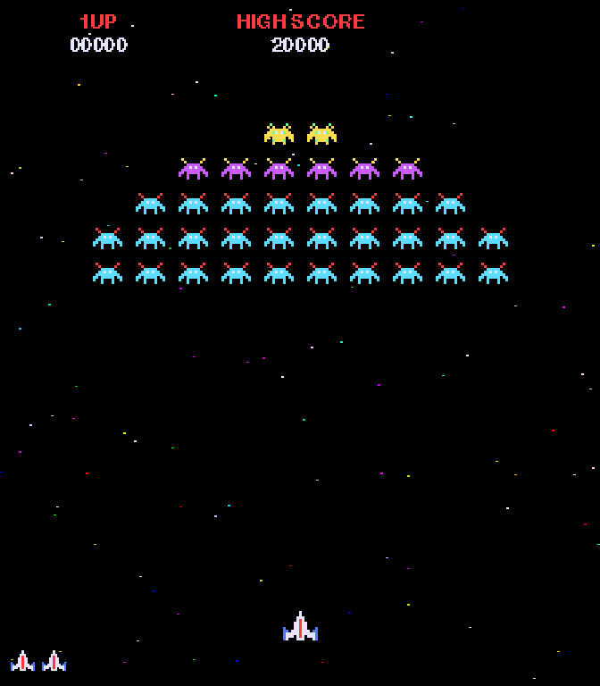

# Upgrading `galaxians-demo` to the real 1979 star circuit

`uv run galaxians-demo` shows this kit's generic starfield dialed to
Galaxian's numbers — right geometry, right colors, right drift, right
population. But it is still a *model*. The companion repo,
**[galaxian-starfield](https://github.com/pmirvine/galaxian-starfield)**,
contains the real thing: a cycle-exact software recreation of the star
generator circuit on the Galaxian video board — the actual 17-bit shift
register, verified against the schematics and MAME.

Because that project ships its whole effect as one self-contained file
(`stars.py`), swapping it into the tableau is a genuine ten-minute
upgrade: one download and three small edits. This guide walks through it
— and it doubles as a worked example of *replacing one starfield
implementation with another*, which is exactly the kind of surgery you'll
do on real projects.

## What actually changes

| | generic kit `Starfield` | arcade `stars.py` |
| --- | --- | --- |
| star shapes | uniform 3×3 blocks (`star_size=3`) | the hardware's 1/3- and 2/3-pixel pulses — thin slivers, rendered at sub-pixel resolution |
| star layout | random, fixed by `seed=1979` | the LFSR's actual 256 positions — the same pattern every Galaxian board ever made |
| twinkle | each star blinks on its own randomized period | the V1⊕H8 gate: stars blink in 8-pixel bands at exactly ~1.9 Hz, as a side effect of the drift |
| drift | ~91 px/s, our arithmetic | exactly one RNG clock per 16.5 ms frame, the hardware's own arithmetic |
| colors | the 63-color DAC palette | identical — the kit already computes the same palette |
| API | `update(dt)` + `draw(screen)` | `update(dt)` + `render(size)` (returns the finished frame to blit) |
| knobs | size, velocity, density, layers, … | none. It is a *circuit*. That's the point. |

One honest caveat from the companion repo: the real shift register
free-runs from power-on, so the *absolute* star positions at any moment
can't match a particular machine — but the star set, colors, geometry,
drift, and twinkle are exact.

## Step 1 — get the file

From the kit's repository root:

```sh
curl -o src/starfield_kit/galaxians/stars.py \
  https://raw.githubusercontent.com/pmirvine/galaxian-starfield/main/src/galaxian_starfield/stars.py
```

(Or clone the repo and copy `src/galaxian_starfield/stars.py` by hand.
It is deliberately self-contained — stdlib + pygame-ce only, same policy
as this kit's `starfield.py`.)

## Step 2 — swap the import

All edits are in
[`src/starfield_kit/galaxians/attract.py`](../src/starfield_kit/galaxians/attract.py).
Both libraries call their class `Starfield`, so import the newcomer under
an honest alias:

```python
# before
from ..retro.ui import draw_text
from ..starfield import Starfield
from . import sprites

# after
from ..retro.ui import draw_text
from . import sprites
from .stars import Starfield as ArcadeStarfield
```

## Step 3 — build the circuit instead of configuring the model

```python
# before
def make_starfield() -> Starfield:
    """The library configured to the cabinet's numbers (see module docs)."""
    return Starfield(
        (WINDOW_W, WINDOW_H),
        velocity=(0, DRIFT_PX_PER_S),
        count=STAR_COUNT,
        star_size=SCALE,
        palette="galaxian",
        seed=1979,
    )

# after
def make_starfield() -> ArcadeStarfield:
    """The real thing: no knobs — the hardware defines everything."""
    return ArcadeStarfield()
```

Every parameter disappears, and each vanishes for a reason worth
noticing: the drift rate, star count, star widths, and palette are all
*consequences of the circuit*, not choices. (`DRIFT_PX_PER_S` and
`STAR_COUNT` become unused constants — keep them as documentation or
delete them, your call.)

## Step 4 — render instead of draw

The arcade module renders its own raster (a rotated 224×256 frame at 3×
horizontal sub-pixel resolution) and hands you the finished picture, so
the first line of `draw_frame()` changes from *paint onto the screen* to
*blit the frame*:

```python
# before
    stars.draw(screen)

# after
    screen.blit(stars.render(screen.get_size()), (0, 0))
```

Also update the type hint in `draw_frame`'s signature
(`stars: Starfield` → `stars: ArcadeStarfield`). Nothing else in the
file changes — `stars.update(dt)` in the main loop is already exactly
what the arcade module wants, and `render()` fills the black sky itself.

This is where the tableau's window size pays off: `render()` scales to
whatever you pass, but at 672×768 — an exact 3× of the cabinet's 224×256
monitor, and a multiple of 3 for the 1/3-pixel star widths — every star
lands on whole pixels with zero blur.

## Step 5 — run it

```sh
uv run galaxians-demo
```



What to look for, next to the generic version you just replaced:

* Stars are now **thin slivers** — one or two window pixels wide instead
  of chunky 3×3 blocks, because real Galaxian stars were pulses a third
  or two-thirds of a pixel long.
* Watch a single star as it drifts: it **blinks in and out as it crosses
  8-pixel bands** (the V1⊕H8 gate), instead of on a private timer.
* The pattern repeats: this is the same 256-star sequence every real
  board generated. You are looking at the output of two 74LS164 shift
  registers from 1979.

## Step 6 — fix the test you just broke

The kit's suite pins the *generic* configuration
(`tests/test_games_and_helpers.py::test_galaxians_attract_matches_the_arcade_numbers`),
so it now fails with an `AttributeError` — the arcade class has no
`star_count` or `velocity`. That failing test is doing its job; teach it
the new facts:

```python
def test_galaxians_attract_matches_the_arcade_numbers():
    from starfield_kit.galaxians import attract, sprites

    # 224x256 native at 3x scale, like the rotated cabinet monitor.
    assert (attract.WINDOW_W, attract.WINDOW_H) == (672, 768)
    stars = attract.make_starfield()
    assert len(stars.stars) == 256  # the full LFSR pattern (4 are black)

    # The tableau draws without crashing, and the convoy is 36 strong.
    assert sum(count for _, count in attract.CONVOY_ROWS) == 36
    screen = pygame.display.set_mode((attract.WINDOW_W, attract.WINDOW_H))
    stars.update(1 / 60)
    attract.draw_frame(screen, stars, sprites.load(attract.SCALE))
```

`uv run pytest` should be green again.

## Step 7 (optional) — play with the hardware latches

The arcade module exposes the board's two control latches; wiring them to
keys in `main()` is a nice five-minute follow-on (the companion repo's
own demo binds **F** and **S** the same way):

```python
elif event.type == pygame.KEYDOWN and event.key == pygame.K_f:
    stars.flipped = not stars.flipped        # cocktail-table flip: drift reverses
elif event.type == pygame.KEYDOWN and event.key == pygame.K_s:
    stars.set_enabled(not stars.enabled)     # the stars-on latch ($B004)
```

## Which one should your own game use?

Keep both in your toolbox and pick per project:

* **The kit's generic `Starfield`** whenever you need *flexibility*: any
  window shape, any scroll direction, live velocity, parallax layers,
  density, palettes. That's every other demo in this kit.
* **The arcade `stars.py`** when you want *authenticity* and can live on
  its terms: a 7:8 portrait picture, downward drift, no knobs. It costs
  the same three lines (`create → update(dt) → render/blit`) as the
  generic one.

And if you want to know *why* the circuit behaves this way — the LFSR
feedback taps, the resistor DAC, the flip-flops that swallow two clocks a
frame — the companion repo's README tells the whole hardware story:
<https://github.com/pmirvine/galaxian-starfield>
